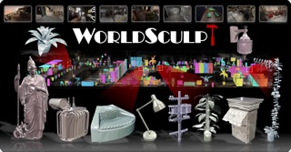
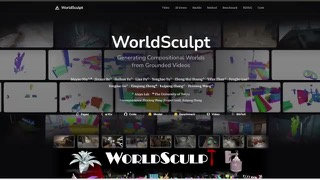

# WorldSculpt

## What it is

Alaya Lab framework that reconstructs cluttered scenes into per-object meshes in a shared world frame, from posed RGB, instance masks, and coarse 3D boxes. The same pipeline can turn generated 3D Gaussian Splatting worlds (for example Marble) into editable compositional meshes.

| | |
|:---:|:---:|
|  |  |

## Why keep

Compare or wire when you need object-level edit and sim-ready parts instead of a fused scene mesh.

## When to reach for it

Local 3D cleanup, AR/VR layout edits, or robotics/sim prep where each object must move independently.

## Caveats

Needs posed views plus instance masks and 3D boxes, not a single casual photo. VRAM and end-to-end run cost are not documented clearly yet; treat as research code. Weights on Hugging Face are Apache-2.0.

## Links

- Homepage: https://alaya-lab.github.io/WorldSculpt/
- GitHub: https://github.com/AlayaLab/WorldSculpt
- Weights: https://huggingface.co/AlayaLab/WorldSculpt
