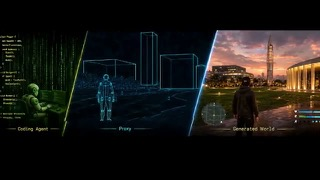
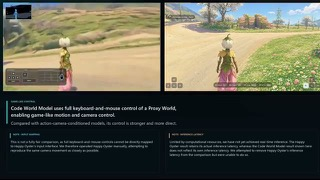
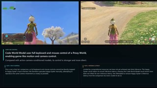
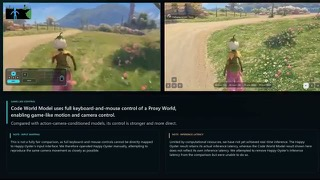

# Code World Model

## What it is

Keeps an AI world consistent by storing rules and state in code (a coding agent as the “brain”), then uses a video model (MiniMax-H3 + CWM LoRA) only for what you see.

| | |
|:---:|:---:|
|  |  |
|  |  |

## Why keep

Useful when building long interactive scenes that must remember events and rules instead of relying on video memory alone.

## When to reach for it

Agent + video / game-like worlds where state has to stay coherent across a long session.

## Caveats

Repo is Apache-2.0; the MiniMax-H3 video backbone has its own community license. Needs a serious GPU setup.

## Links

- Homepage: https://buaacyw.github.io/cwm/
- GitHub: https://github.com/buaacyw/code-world-model
- Weights: https://huggingface.co/NTU-yiwen/awm-minimax-h3-new1344-lora-checkpoints
