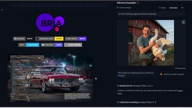
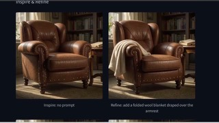
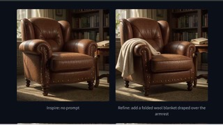
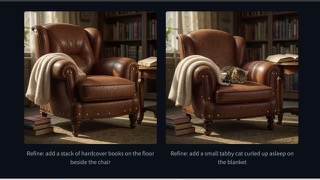

# Fibo 1.5

## What it is

Bria JSON-native image generator/editor; 1.5 is a faster few-step distilled FIBO build with structured prompts and natural-language edits.

| | |
|:---:|:---:|
|  |  |
|  |  |

## Why keep

Reach for when you want controllable, licensed-data image gen and structured prompts matter more than absolute SOTA looks.

## When to reach for it

Local non-commercial experiments, ComfyUI, or Bria/Fal/Replicate API (~$0.02–$0.03/image on pay-as-you-go lists).

## Caveats

Open weights are non-commercial only; commercial use needs Bria licensing. Quality may lag some closed competitors on raw pretty-image contests.

## Links

- GitHub: https://github.com/Bria-AI/FIBO
- Weights: https://huggingface.co/briaai/Fibo-1.5
