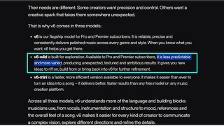
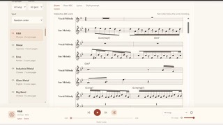

# Suno v6

## What it is

Suno’s closed music-model family (Sep 2026): **v6** (precise flagship), **v6-wild** (exploratory), and **v6-mini** (faster free tier). Adds plain-language section edits, mashups, sampling/isolation, multimodal prompts (text, audio, image, video), and single-lyric updates. Developed with industry partners including Warner Music Group, BMG, and Believe.

| | |
|:---:|:---:|
|  |  |
|  |  |

## Why keep

Compare paid music generation when you need editorial control and a polished cloud product rather than local open weights.

## When to reach for it

Pro/Premier workflows that need reliable edits and mashups; use v6-mini only for quick free drafts.

## Caveats

Closed SaaS; full v6 / v6-wild need paid plans. Prior models retired on rollout. Download and commercial-use limits follow Suno’s current terms. Not runnable locally.

## Links

- Homepage: https://suno.com/release-notes/introducing-v6
- FAQ: https://help.suno.com/en/articles/13924481
- Pricing: https://suno.com/pricing
