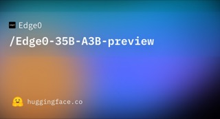
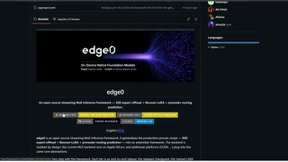
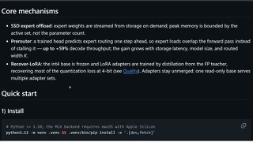

# Edge0

## What it is

Open-source streaming MoE inference (MLX) that keeps expert weights on SSD and loads only the active set. Ships Edge0-35B-A3B (Qwen3.5-MoE, ~**2.9 GiB** peak active memory, ~**23 GB** on disk) and Edge0-8B-A1B (Ling 3.0, ~**1.0 GiB** active). Uses 4-bit weights, Recover-LoRA, and a prerouter for prefetch.

| | |
|:---:|:---:|
|  |  |
|  |   |

## Why keep

Reach for when you want a large MoE on Apple Silicon without holding the full checkpoint in RAM.

## When to reach for it

Mac mini / MacBook local chat with limited unified memory, or comparing SSD expert-offload versus llama.cpp-style mmap offload.

## Caveats

Apple Silicon / MLX only in this release; CUDA is roadmap. Active-memory numbers are short-context floors; KV cache grows with length. Preview quality and agent/tool support may lag full-precision bases. Apache-2.0.

## Links

- Homepage: https://edge0.ai/models/edge0-35b
- GitHub: https://github.com/Edge0-AI/edge0
- Weights (35B): https://huggingface.co/Edge0/Edge0-35B-A3B-preview
- Weights (8B): https://huggingface.co/Edge0/Edge0-8B-A1B-preview
