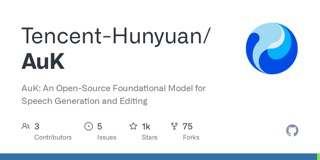
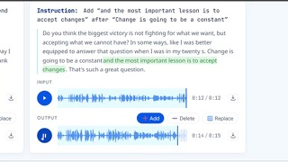
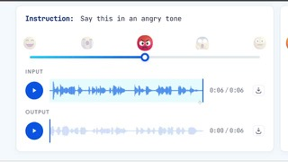

# AuK

## What it is

Tencent Hunyuan 1.5B speech foundation model that does TTS, zero-shot voice cloning, content micro-edits, enhancement, and related tasks through natural-language instructions. AuK-Flash is the distilled four-step variant for faster inference.

| | |
|:---:|:---:|
|  |  |
|  |   |

## Why keep

Local speech generate-and-edit in one stack when you need clone, word-level rewrite, denoise, or emotion/timbre changes without a closed API.

## When to reach for it

Content pipelines that edit existing speech or generate new takes on a consumer GPU; compare AuK vs AuK-Flash for quality versus speed.

## Caveats

Official VRAM guidance is thin; weight download is roughly 6–7 GB before runtime overhead. MIT license on the released code and weights; still verify provenance and consent for any cloned voice.

## Links

- Homepage: https://auk-project.github.io/
- GitHub: https://github.com/Tencent-Hunyuan/AuK
- Weights: https://huggingface.co/tencent/AuK
- Flash weights: https://huggingface.co/tencent/AuK-Flash
