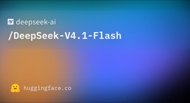
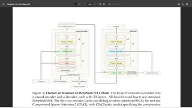
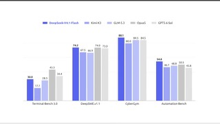
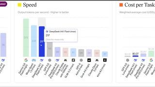

# DeepSeek-V4.1-Flash

## What it is

DeepSeek multimodal MoE with a **552B** backbone, **8B** active on prefill and **16B** on decode, native image+text input, and up to **1M** context. Causal encoder-decoder design with aggressive KV compression. API id `deepseek-flash`; MIT weights on Hugging Face.

| | |
|:---:|:---:|
|  |  |
|  |  |

## Why keep

Compare frontier open multimodal models for agent and coding work, especially when cheap API speed matters or you evaluate long-context / KV-efficient stacks.

## When to reach for it

DeepSeek API bake-offs, or multi-GPU self-host (reference and vLLM/SGLang recipes target roughly **8×** high-memory GPUs; checkpoint ~**510 GB** on disk).

## Caveats

“Flash” and “8B active” do not mean consumer-GPU local. Full weights are already FP8/FP4 mixed; community quants may appear later but official local is multi-GPU class. Confirm current API pricing and routing (legacy V4-Flash / V4-Pro aliases may redirect).

## Links

- Homepage / API news: https://api-docs.deepseek.com/news/news260910
- Weights: https://huggingface.co/deepseek-ai/DeepSeek-V4.1-Flash
