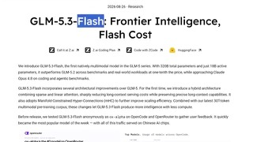
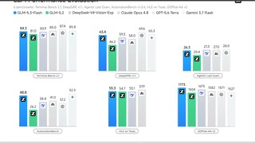
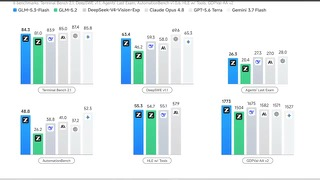
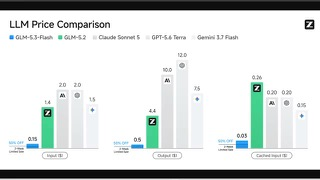

# GLM-5.3-Flash

## What it is

Z.ai natively multimodal open model (text and images; video/file claimed on cards). MIT weights on Hugging Face. Previously known as Ox Alpha.

| | |
|:---:|:---:|
|  |  |
|  |  |

## Why keep

Compare when choosing an open multimodal model for coding/agent work with a strong API price pitch.

## When to reach for it

Local (SGLang/vLLM/TokenSpeed) or Z.ai/OpenRouter-style API bake-offs against other frontier opens.

## Caveats

List API about $0.15 / $0.50 per 1M input/output tokens (promos vary). Full local needs multi-GPU. Confirm current license text on the model card before redistribute.

## Links

- Homepage: https://z.ai/blog/glm-5.3-flash
- Weights: https://huggingface.co/zai-org/GLM-5.3-Flash
