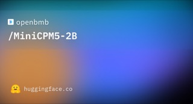
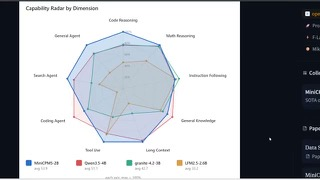

# MiniCPM5-2B

## What it is

OpenBMB dense ~**2B** on-device LLM (MiniCPM5 series) with long context, tool use, and agent-oriented post-training (RL + OPD). Apache-2.0 weights plus GGUF, MLX, and GPTQ builds; training datasets also published. Roundup “mini CPM 52B” ASR maps to this **MiniCPM5-2B** release.

| | |
|:---:|:---:|
|  |  |

## Why keep

Compare tiny local models when edge footprint and small-size coding/math/agent scores matter more than frontier scale.

## When to reach for it

Phone, laptop, or low-VRAM boxes via transformers / llama.cpp / MLX, or bake-offs against other sub-4B opens.

## Caveats

Vendor harness SOTA claims need independent re-checks; Artificial Analysis sub-4B ranking is a separate public signal. Still a small model: expect limits on hard long-horizon agent work versus larger MoEs.

## Links

- GitHub: https://github.com/OpenBMB/MiniCPM
- Weights: https://huggingface.co/openbmb/MiniCPM5-2B
- GGUF: https://huggingface.co/openbmb/MiniCPM5-2B-GGUF
- Demo: https://huggingface.co/spaces/openbmb/MiniCPM5-2B-Demo
