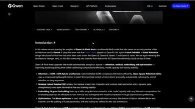
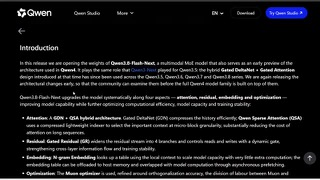
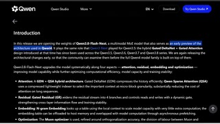
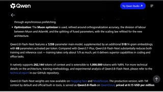

# Qwen3.8-Flash-Next

## What it is

Alibaba Qwen open-weight multimodal MoE; early preview of the Qwen4-era architecture. Production hosted twin is Qwen3.8-Flash on QwenCloud.

| | |
|:---:|:---:|
|  |  |
|  |  |

## Why keep

Compare against GLM-5.3-Flash and other open multimodal stacks for coding, office, and agent work at a low API price point.

## When to reach for it

Self-host bake-offs or QwenCloud/OpenRouter-style API use when cost and multimodal matter.

## Caveats

Qwen Community License 1.0 (extra rules for MaaS / AI work-assistant commercial use). Hosted Flash roughly ~$0.15–$0.16 / ~$0.47 per 1M in/out. Local still needs solid multi-GPU or quants.

## Links

- Homepage: https://qwen.ai/blog?id=qwen3.8-flash-next
- GitHub: https://github.com/qwenlm/qwen3.8-flash-next
- Weights: https://huggingface.co/Qwen/Qwen3.8-Flash-Next
