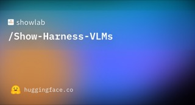
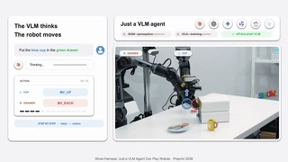
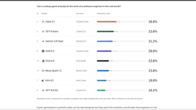

# Show-Harness

## What it is

Show Lab embodied harness that lets a vision-language model control robots through discrete semantic action units, with embodiment-specific interpreters grounding those units into motion. Supports zero-shot frontier VLMs (API) and fine-tuned small open VLMs (LoRA adapters). GUMI collects demos via GUI without specialized teleop hardware.

| | |
|:---:|:---:|
|  |  |
|  |   |

## Why keep

Compare or wire when you want VLM-as-policy control across Franka, AgileX Piper, ManiSkill, or RoboLab instead of training a full VLA from scratch.

## When to reach for it

Robot or sim experiments where semantic actions (for example fixed 2 cm steps) are enough, and you already have a VLM endpoint or can fine-tune a small Qwen/Gemma adapter.

## Caveats

Needs a real robot or supported simulator. Frontier zero-shot path depends on closed APIs. Released Qwen LoRAs are Apache-2.0; Gemma adapters follow Gemma terms. Success depends on how well the semantic action set matches the task.

## Links

- Homepage: https://showlab.github.io/Show-Harness/
- GitHub: https://github.com/showlab/Show-Harness
- Weights: https://huggingface.co/showlab/Show-Harness-VLMs
- Data: https://huggingface.co/datasets/showlab/Show-Harness-Data
