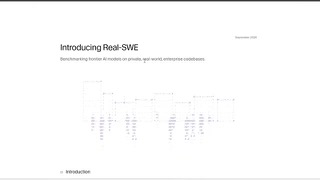

# Real-SWE

## What it is

Specific Labs coding-agent benchmark built from licensed private production codebases and real engineering tickets (billing, migrations, infra), scored as model-and-harness pairs with pass@1 over multiple rollouts. Early leaderboard tops out around **38.8%** (well below saturated public SWE-bench scores).

| | |
|:---:|:---:|
|  |   |

## Why keep

Compare coding agents when public SWE-bench numbers look saturated and you care about private, out-of-distribution company work.

## When to reach for it

Bake-offs for Claude Code / Codex / Gemini CLI style harnesses on messier multi-file business tasks, or when tracking whether a new model closes the public-vs-private gap.

## Caveats

Tasks are not a public download; sample and full access are request-only through Specific Labs. Scores mix model and harness, so rankings are not pure model apples-to-apples. Methodology has drawn reproducibility pushback because the underlying code stays private.

## Links

- Homepage: https://realswe.withspecific.com
- YC launch: https://www.ycombinator.com/launches/TpS-real-swe-a-coding-benchmark-built-from-private-company-codebases
